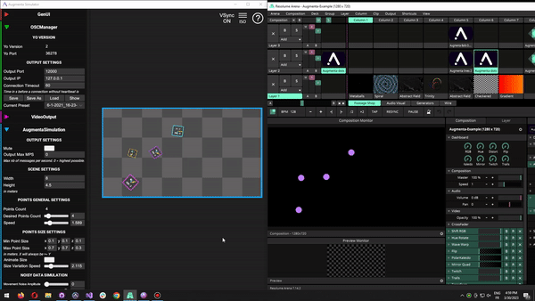

# Getting started with Resolume

<figure><figcaption>
Example project using Augmenta in Resolume
</figcaption></figure>

 

<figure><figcaption>
Plugin Resolume used at an art residency in Thaîland
</figcaption></figure>

## Resolume

[Resolume](https://resolume.com/) Arena is one of the reference tools in live performance and video installations for editing and publishing live images, vijing and video mapping. It allows you to create and play VJ sets and videomappings for scenic or architectural dressing and multimedia shows.

It's a very popular software that can get you to prototype or build interactive content in minutes without any coding skills, or nodals tools, just Resolume VJ skills !

## Video tutorial



This video shows how to open the example in Resolume and how to set up Augmenta Fusion to send data to it.

## Written tutorial

Prerequisites:

* Having [Resolume](https://resolume.com/) Arena 7+ installed on your computer
* Having [Augmenta simulator](https://augmenta.tech/downloads) installed on your computer

### Install

Download the Augmenta Resolume plugin [here](https://github.com/Augmenta-tech/Augmenta-Resolume/releases/latest)

Drag'n drop each effect into resolume and click on install

<figure><figcaption></figcaption></figure>

Activate OSC input

<figure><figcaption></figcaption></figure>

### Use

**Note** : This is a beta feature, not yet available in the simulator, so we use Fusion instead

Start Fusion and setup your scene size and resolution

Add a Generator or "Add manually..." a source

If you have a manual source, set the local port to 12000, open the Augmenta Simulator and add the number of points you want

In Augmenta Fusion, add a Resolume output

<figure><figcaption></figcaption></figure>

⚠️ Start Resolume and **set your composition to the same resolution of Fusion**

<figure><figcaption></figcaption></figure>

Drag 'n drop Augmenta dots. Points should be moving !

<figure><figcaption></figcaption></figure>

### Limitation

Augmenta Resolume effect currently supports a maximum of 20 tracked objects.

###
